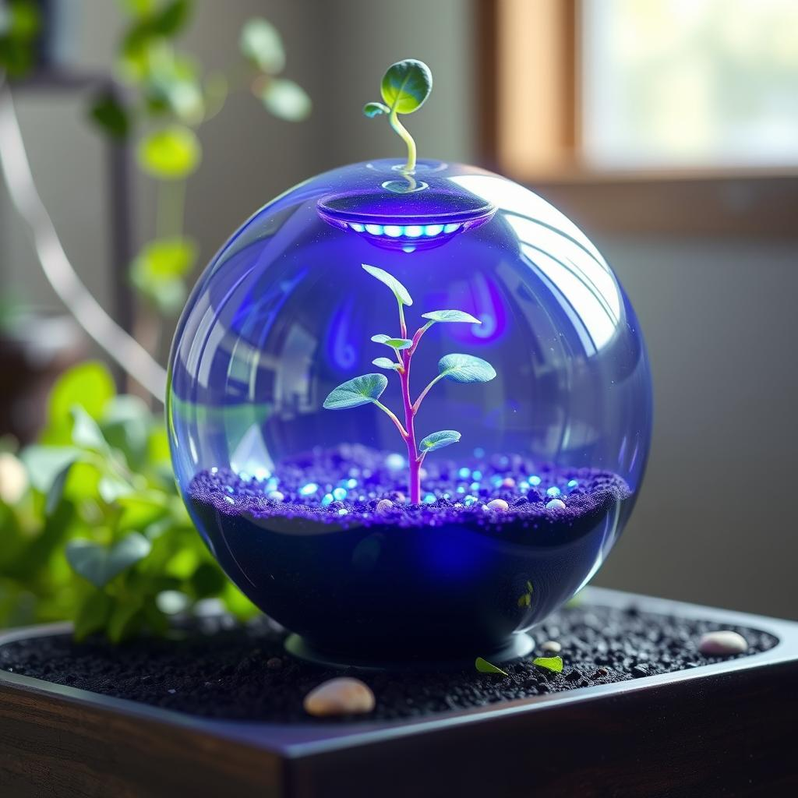

<p align="center"><h1 align="center">TEXT-TO-IMAGE-ITEM-GENERATOR</h1></p>
<p align="center">
	<em>Words to Images: Instantly.
</em>
</p>
<p align="center">
	<!-- local repository, no metadata badges. --></p>
<p align="center">Built with the tools and technologies:</p>
<p align="center">
	
	
	
	
	
</p>
<br>

##  Table of Contents

- [ Overview](#-overview)
- [ Features](#-features)
- [ Project Structure](#-project-structure)
  - [ Project Index](#-project-index)
- [ Getting Started](#-getting-started)
  - [ Prerequisites](#-prerequisites)
  - [ Installation](#-installation)
  - [ Usage](#-usage)
  - [ Testing](#-testing)
- [ License](#-license)

---

##  Overview

This project generates unique product images from randomly generated names.  Using AI, it combines text-to-image generation with a streamlined workflow, creating novel visuals for marketing, design, or creative exploration.  Ideal for designers, marketers, or anyone needing quick, visually appealing product mockups.

<p align="center">
  
  
  
  <br>
  
  
  
  <br>
  
  
  
  <br>
  
  
  
</p>

---

##  Features

|      | Feature         | Summary       |
| :--- | :---:           | :---          |
| ⚙️  | **Architecture**  | <ul><li>The project uses a two-stage architecture: first, a `large language model` generates a product name; second, a `diffusion model` generates an image based on that name. </li><li>The system relies on pre-trained models for both text and image generation, indicating a reliance on existing, powerful models rather than training new ones from scratch.</li><li>The `main.py` file orchestrates the interaction between the language model and the diffusion model. </li><li>Random seed generation ensures variability in output images for the same input text.</li></ul> |
| 🔌 | **Integrations**  | <ul><li>The project integrates `Hugging Face Hub` libraries (`transformers` and `diffusers`), indicating the use of pre-trained models from the Hugging Face ecosystem.</li><li>It leverages `PyTorch` and `CUDA` for efficient deep learning computations, specifically utilizing version 11.8 of CUDA.</li></ul> |

---

##  Project Structure

```sh
└── text-to-image-item-generator/
    ├── environment.yml
    ├── main.py
    ├── nice_images_generated
    └── pytorch-check.py
```


###  Project Index
<details open>
	<summary><b><code>TEXT-TO-IMAGE-ITEM-GENERATOR/</code></b></summary>
	<details> <!-- __root__ Submodule -->
		<summary><b>__root__</b></summary>
		<blockquote>
			<table>
			<tr>
				<td><b><a href='./environment.yml'>environment.yml</a></b></td>
				<td>- environment.yml specifies the project's Python environment, ensuring reproducibility<br>- It defines necessary packages for text-to-image generation, including PyTorch with CUDA 11.8 support,  Hugging Face libraries (Transformers, Diffusers), and related dependencies<br>- This file facilitates consistent setup across different machines, enabling seamless execution of the text-to-image generation application.</td>
			</tr>
			<tr>
				<td><b><a href='./main.py'>main.py</a></b></td>
				<td>- The program generates a short, random product name using a large language model<br>- It then leverages a diffusion model to create and display an image based on this generated name<br>- The process incorporates random seed generation for variability and utilizes a pre-trained model for both text and image generation, offering a streamlined workflow for creative content generation.</td>
			</tr>
			<tr>
				<td><b><a href='./pytorch-check.py'>pytorch-check.py</a></b></td>
				<td>- Pytorch-check.py verifies PyTorch and CUDA installations<br>- It reports the PyTorch version, CUDA version used during PyTorch's build, and CUDA availability<br>- This pre-flight check ensures the necessary deep learning dependencies are correctly configured before executing the main application, preventing runtime errors.</td>
			</tr>
			</table>
		</blockquote>
	</details>
</details>

---
##  Getting Started

###  Prerequisites

Before getting started with text-to-image-item-generator, ensure your runtime environment meets the following requirements:

- **Programming Language:** Python 3.11
- **Package Manager:** Conda
- **Architecture:** CUDA 11.8 (You can find different architectures and versions on the official PyTorch website - check `main.py` comments for links)
- **Disk Space:** ~60GB - local models and environment dependencies + a few GB for necessary tools


###  Installation

Install text-to-image-item-generator using the following method:

1. Clone the text-to-image-item-generator repository:
```sh
git clone https://github.com/Eyelor/text-to-image-item-generator
```

2. Navigate to the project directory:
```sh
cd text-to-image-item-generator
```

3. Install the project dependencies:

Before doing this, you can check which architecture is best for your GPU or CPU. In my case, for the RTX 20xx series, CUDA 11.8 was the best choice. Do your research to find the right architecture for your hardware and choose compatible versions for other dependencies accordingly in the `environment.yml` file.

**Using `conda`**

```sh
conda env create -f environment.yml
```


###  Usage
Run text-to-image-item-generator using the following commands:

**Using `conda`**

```sh
conda activate text-to-image-item-generator_env
```

**Using `python`**

```sh
python main.py
```

If something is not working properly, check the files for comments.


###  Testing
Run the configuration test using the following command:

**Using `python`**

```sh
python pytorch-check.py
```

Based on the response from this test, you can see which versions of `PyTorch` and `CUDA` you are using and whether they are available.


---

##  License

This project is protected under the Apache 2.0 License. For more details, refer to the [LICENSE](./LICENSE) file.

---

